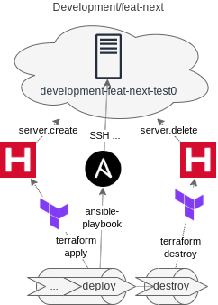

<!-- omit in toc -->
# Infrastructure Template


[](https://github.com/pre-commit/pre-commit)
[](https://conventionalcommits.org)
[](https://github.com/semantic-release/semantic-release)


[](https://gitlab.com/xebis/infrastructure-template/-/commits/main)

Template for automated GitOps and IaC in a cloud.

GitLab CI handles static and dynamic environments. Environments are created, updated, and destroyed by Terraform, then configured by cloud-init and Ansible.

**The project is under active development.** The project is a fork of [xebis/repository-template](https://github.com/xebis/repository-template).

<!-- omit in toc -->
## The Goal

The goal is to have a GitOps repository to automatically handle environments life cycle - its creation, update, configuration, and eventually destroy as well.

> GitOps = IaC + MRs + CI/CD

_[GitLab: What is GitOps?](https://about.gitlab.com/topics/gitops/)_

<!-- omit in toc -->
## Table of Contents

- [Features](#features)
  - [Environment Configuration](#environment-configuration)
  - [Images](#images)
- [Installation and Configuration](#installation-and-configuration)
  - [Set up GitLab CI](#set-up-gitlab-ci)
  - [Set up Local Usage](#set-up-local-usage)
- [Usage](#usage)
  - [GitLab CI](#gitlab-ci)
  - [Local Usage](#local-usage)
- [Contributing](#contributing)
  - [Testing](#testing)
- [To-Do list](#to-do-list)
- [Roadmap](#roadmap)
- [Credits and Acknowledgments](#credits-and-acknowledgments)
- [Copyright and Licensing](#copyright-and-licensing)
- [Changelog and News](#changelog-and-news)
- [Notes and References](#notes-and-references)
  - [Dependencies](#dependencies)
  - [Recommendations](#recommendations)
  - [Suggestions](#suggestions)
  - [Further Reading](#further-reading)

## Features

Optimized for [GitHub flow](https://guides.github.com/introduction/flow/), easily adjustable to [GitLab flow](https://docs.gitlab.com/ee/topics/gitlab_flow.html) or any other workflow.


Automatically checks conventional commits, validates Markdown, YAML, shell scripts, Terraform (HCL), runs tests, deployments, releases, and so on. See [GitHub - xebis/repository-template: Well-manageable and well-maintainable repository template.](https://github.com/xebis/repository-template) for full feature list.

Environments are provisioned by Terraform at Hetzner Cloud, configured by cloud-init and Ansible over SSH.



Automatically managed environments:

- On *release* tag runs **production** environment deploy
- On `main` branch commit runs **staging** environment deploy
  - Releases and creates *release* tag when a commit starting `feat` or `fix` is present in the history from the previous release
- On *pre-release* tag runs **testing/_tag_** environment deploy with 1 week or manual destruction
- On _non-_`main` branch commit under certain conditions runs **development/_branch_** environment deploy with 1 day or manual destruction:
  - It runs only when there's a change in `**/*{.tf,.tf.json,.tfvars,.tfvars.json}`, `.terraform.lock.hcl`, `{cloud-config,playbook}.yml`, or `roles/**/*`
  - It runs when the environment already exists or existed in the past (when Terraform backend returns HTTP status code `200 OK` for the environment state file)
  - It runs when the pipeline is run by the *pipelines API*, *GitLab ChatOps*, created by using *trigger token*, created by using the **Run pipeline** *button in the GitLab UI* or created by using the *GitLab WebIDE*
  - It runs when the pipeline is by a *`git push` event* or is *scheduled pipeline*, but only if there's present the environment variable `ENV_CREATE` or `CREATE_ENV`
  - It doesn't run when the environment variable `ENV_SKIP` or `SKIP_ENV` is present, or the commit message contains `[env skip]` or `[skip env]`, using any capitalization

Manually managed environments:

- Create, update, or destroy any environment

### Environment Configuration

All machines:

- have updated packages
- are rebooted when the update (or any earlier operation) requires reboot

### Images

- [Git workflow examples & template](images/workflow.drawio) - inspired by [diagrams.net: Blog - How to create a gitflow diagram](https://www.diagrams.net/blog/gitflow-diagram)
- [Example of the full workflow](images/workflow-full.png)
- [Deploy in more detail](images/deploy.png)

## Installation and Configuration

Prepare Hetzner Cloud API token and GitLab CI SSH keys:

- [Hetzner Cloud - referral link with €20 credit](https://hetzner.cloud/?ref=arhwlvW4nCxX)
  - Hetzner Cloud Console -> Projects -> *Your Project* -> Security -> API Tokens -> Generate API Token `Read & Write`
- Generate GitLab CI SSH keys `ssh-keygen -t rsa` (no passphrase, _to your secret file_, **do not commit it!**), file with `.pub` extension will be generated automatically, put `*.pub` file contents at [`cloud-config.yml`](cloud-config.yml) under section `users:name=gitlab-ci` to the `ssh_authorized_keys` as the first element, and commit it

### Set up GitLab CI

- GitLab -> Settings
  - General > Visibility, project features, permissions > Operations: **on**
  - CI/CD > Variables:
    - Add variable: Key `HCLOUD_TOKEN`, Value `<token>`
    - Add variable: Key `GL_CI_SSH_KEY`, Value _contents of your secret file_ created by `ssh-keygen -t rsa` above

### Set up Local Usage

You can edit and source `scripts/secrets.sh` script, **please make sure you won't commit your secrets**.

```shell
export GL_TOKEN="<token>" # Your GitLab's personal access token with the api scope
export TF_HTTP_PASSWORD="$GL_TOKEN" # Set password for Terraform HTTP backend
export HCLOUD_TOKEN="<token>" # Your Hetzner API token
export TF_VAR_ENV_NAME="<environment>" # Replace with the environment name
export TF_VAR_ENV_SLUG="<env>" # Replace with the environment slug
export TF_VAR_ENV_TIER="<tier>" # Replace with the environment slug, permitted values are "production", "staging", "testing", "development", or "other" (default)
```

- Setup repository by `scripts/setup`, install dependencies by `sudo scripts/bootstrap` script, update repository by `scripts/update` script.
- Replace with your public SSH key at [`cloud-config.yml`](cloud-config.yml) under section `users:name=mb` to the `ssh_authorized_keys` as the first element, and commit it

## Usage

### GitLab CI

- Commit and push to run validations
- Push a _non-_`main` branch
  - To create a **development/_branch_** environment you have to create a new pipeline for the branch using API, GitLab ChatOps, trigger token, or by using the **Run pipeline** button in the GitLab UI
  - Alternatively, you can create a **development/_branch_** environment directly by pushing or scheduling with `ENV_CREATE` or `CREATE_ENV` environment variable present, for example by running `git push -o ci.variable="CREATE_ENV=true"`
  - Once created, the environment will be updated (or recreated if it was destroyed) with each subsequent pipeline on the branch
  - Environment deploy is skipped when the environment variable `ENV_SKIP` or `SKIP_ENV` is present, or commit message contains `[env skip]` or `[skip env]`, using any capitalization, or when CI pipeline is skipped altogether, for example using `git push -o ci.skip`
  - Destroy **development/_branch_** environment manually, or wait until auto-stop (1 day from the last commit in the branch in GitLab, could be overridden in GitLab UI)
- Create a *pre-release* tag to create **testing/_tag_** environment
  - Pre-release tag must match regex `^v(0|[1-9]\d*)\.(0|[1-9]\d*)\.(0|[1-9]\d*)(?:-((?:0|[1-9]\d*|\d*[a-zA-Z-][0-9a-zA-Z-]*)(?:\.(?:0|[1-9]\d*|\d*[a-zA-Z-][0-9a-zA-Z-]*))*))(?:\+([0-9a-zA-Z-]+(?:\.[0-9a-zA-Z-]+)*))?$`, see <https://regex101.com/r/G1OFXH/1>
  - Destroy **testing/_tag_** environment manually, or wait until auto-stop (1 week, could be overridden in GitLab UI)
- Merge to the `main` branch to create or update the **staging** environment
- Creates or updates **production** environment when a commit starting `feat` or `fix` is present in the history from the previous release
  - *Release* tag must match regex `^v(0|[1-9]\d*)\.(0|[1-9]\d*)\.(0|[1-9]\d*)?(?:\+([0-9a-zA-Z-]+(?:\.[0-9a-zA-Z-]+)*))?$`, see <https://regex101.com/r/9DFqb3/1>

*Release* and *pre-release* tags must follow SemVer string, see [Semantic Versioning 2.0.0: Is there a suggested regular expression (RegEx) to check a SemVer string?](https://semver.org/#is-there-a-suggested-regular-expression-regex-to-check-a-semver-string)

### Local Usage

Initialize local workspace if not yet initialized:

```shell
# Init local workspace
terraform init -reconfigure \
    -backend-config="address=https://gitlab.com/api/v4/projects/31099306/terraform/state/$TF_VAR_ENV_SLUG" \
    -backend-config="lock_address=https://gitlab.com/api/v4/projects/31099306/terraform/state/$TF_VAR_ENV_SLUG/lock" \
    -backend-config="unlock_address=https://gitlab.com/api/v4/projects/31099306/terraform/state/$TF_VAR_ENV_SLUG/lock"
```

- Create or update environment by `terraform apply` or `terraform apply -auto-approve`
- Get server IP address by `terraform output hcloud_server_test_ipv4_address`
- SSH by `ssh root@$(terraform output -raw hcloud_server_test_ipv4_address)`
- Ansible:
  - Ping: `ansible -u root -i $(terraform output -raw hcloud_server_test_ipv4_address), all -m ansible.builtin.ping`
  - Get all facts: `ansible -u root -i $(terraform output -raw hcloud_server_test_ipv4_address), all -m ansible.builtin.setup`
  - Configure with playbook: `ansible-playbook -u root -i $(terraform output -raw hcloud_server_test_ipv4_address), playbook.yml`
- Destroy environment by `terraform destroy` or `terraform destroy -auto-approve`

Uninitialize local workspace if you wish:

```shell
rm -rf .terraform # Uninit local workspace, this step is required if you would like to work with another environment
```

Commit and push to run validations.

## Contributing

Please read [CONTRIBUTING](CONTRIBUTING.md) for details on our code of conduct, and the process for submitting merge requests to us.

### Testing

- Git hooks check a lot of things for you, including running automated tests `scripts/test full`
- Make sure all `scripts/*`, git hooks, and GitLab pipelines work as expected, testing checklist:

- `scripts/*` scripts - covered by unit tests `tests/*`
  - [ ] [`scripts/bootstrap`](scripts/bootstrap)
  - [ ] [`scripts/dev-env`](scripts/dev-env)
  - [ ] [`scripts/pre-commit`](scripts/pre-commit)
  - [ ] [`scripts/pre-push`](scripts/pre-push)
  - [ ] [`scripts/secrets.sh`](scripts/secrets.sh)
  - [ ] [`scripts/setup`](scripts/setup)
  - [ ] [`scripts/test`](scripts/test)
  - [ ] [`scripts/update`](scripts/update)
- Local working directory
  - [ ] `git commit` runs `pre-commit` hook-type `commit-msg` and [`scripts/pre-commit`](scripts/pre-commit)
  - [ ] `git merge`
    - [ ] Fast-forward shouldn't run any hooks or scripts
    - [ ] Automatically resolved `merge commit` runs `pre-commit` hook-type `commit-msg` and [`scripts/pre-commit`](scripts/pre-commit)
    - [ ] Manually resolved `merge commit` runs `pre-commit` hook-type `commit-msg` and [`scripts/pre-commit`](scripts/pre-commit)
  - [ ] `git push` runs [`scripts/pre-push`](scripts/pre-push)
  - Terraform and Ansible
    - [ ] `terraform init`
    - [ ] `terraform plan`
    - [ ] `terraform apply`
    - [ ] `ansible ... ping`
    - [ ] `ansible-playbook`
    - [ ] `terraform destroy`
- GitLab CI
  - [ ] Commit on a new _non-_`main` branch runs `validate:lint` and `validate:test-full`
    - [ ] Without any environment variables, runs `deploy:deploy-dev`, and prepares `destroy:destroy-dev`
    - [ ] With environment variable `ENV_CREATE` or `CREATE_ENV`, runs `deploy:deploy-dev`, and prepares `destroy:destroy-dev`
  - [ ] Commit on an existing _non-_`main` branch within 24 hours runs `deploy:deploy-dev`, and prepares `destroy:destroy-dev`
  - [ ] Absence of commit on an existing _non-_`main` branch within 24 hours auto-stops **development/_branch_** environment
  - [ ] *Pre-release* tag on a _non-_`main` branch commit runs `validate:lint`, `validate:test-full`, `deploy:deploy-test`, and prepares `destroy:destroy-test`
    - [ ] After a week auto-stops **testing/_tag_** environment
  - [ ] Merge to the `main` branch runs `validate:lint`, `validate:test-full`, `deploy:deploy-stag`, and `release:release`
    - [ ] With a new `feat` or `fix`, commit releases a new version
    - [ ] *Release* tag on the `main` branch commit runs `validate:lint`, `validate:test-full` and `deploy:deploy-prod`
    - [ ] Without a new feature or fix commit does not release a new version
  - [ ] Scheduled (nightly) pipeline runs `validate:lint` and `validate:test-nightly`

## To-Do list

- [ ] Fix workaround for pre-commit `jumanjihouse/pre-commit-hooks` hook `script-must-have-extension` - `*.bats` shouldn't be excluded
- [ ] Fix workaround for pre-commit `local` hook `shellcheck` - shellcheck has duplicated parameters from `.shellcheckrc`, because these are not taken into account

## Roadmap

- [ ] Find a satisfactory way how to manage (list, install, update) dependencies across various distributions and package managers
- [ ] Add [pre-commit meta hooks](https://pre-commit.com/#meta-hooks)
- [ ] Add [jumanjihouse/pre-commit-hooks hook protect-first-parent](https://github.com/jumanjihouse/pre-commit-hooks#protect-first-parent)
- [ ] Speed up CI/CD by preparing a set of Docker images with pre-installed dependencies for each CI/CD stage, or by cache for `apk`, `pip`, and `npm`

## Credits and Acknowledgments

- [Martin Bružina](https://bruzina.cz/) - Author

## Copyright and Licensing

- [MIT License](LICENSE)
- Copyright © 2021 Martin Bružina

## Changelog and News

- [Changelog](CHANGELOG.md)

## Notes and References

### Dependencies

- [Hetzner Cloud - referral link with €20 credit](https://hetzner.cloud/?ref=arhwlvW4nCxX)
- [Terraform](https://www.terraform.io/)
  - [Terraform: Hetzner Cloud Provider](https://registry.terraform.io/providers/hetznercloud/hcloud/latest/docs)
  - [GitHub - antonbabenko/pre-commit-terraform: pre-commit git hooks to take care of Terraform configurations](https://github.com/antonbabenko/pre-commit-terraform)
  - [GitHub - terraform-linters/tflint: A Pluggable Terraform Linter](https://github.com/terraform-linters/tflint)
  - [checkov](https://www.checkov.io/)
- [Ansible](https://www.ansible.com/)
  - [GitHub - ansible-community/ansible-lint: Best practices checker for Ansible](https://github.com/ansible-community/ansible-lint)
- [cloud-init](https://cloud-init.io/)
- [Docker Hub - hashicorp/terraform](https://hub.docker.com/r/hashicorp/terraform/)
- [Docker Hub - gableroux/ansible](https://hub.docker.com/r/gableroux/ansible)
- [GitHub - xebis/repository-template: Well-manageable and well-maintainable repository template.](https://github.com/xebis/repository-template)

### Recommendations

- [GitHub - shuaibiyy/awesome-terraform: Curated list of resources on HashiCorp's Terraform](https://github.com/shuaibiyy/awesome-terraform)
- [GitHub - KeyboardInterrupt/awesome-ansible: Awesome Ansible List](https://github.com/KeyboardInterrupt/awesome-ansible)
- [GitHub - hetznercloud/awesome-hcloud: A curated list of awesome libraries, tools, and integrations for Hetzner Cloud](https://github.com/hetznercloud/awesome-hcloud)

### Suggestions

- [Visual Studio Code](https://code.visualstudio.com/) with [Extensions for Visual Studio Code](https://marketplace.visualstudio.com/VSCode):
  - [HashiCorp Terraform](https://marketplace.visualstudio.com/items?itemName=HashiCorp.terraform)
  - [Ansible](https://marketplace.visualstudio.com/items?itemName=tomaciazek.ansible)

### Further Reading

- [GitLab: What is GitOps?](https://about.gitlab.com/topics/gitops/)
- [Semantic Versioning - Semantic Versioning 2.0.0](https://semver.org/)
  - [RegEx101: Valid Semantic Versions](https://regex101.com/r/vkijKf/1/)
  - [RegEx101: Valid Release Semantic Versions](https://regex101.com/r/9DFqb3/1)
  - [RegEx101: Valid Pre-release Semantic Versions](https://regex101.com/r/G1OFXH/1)
- [Conventional Commits - Conventional Commits 1.0.0](https://www.conventionalcommits.org/en/v1.0.0/)
